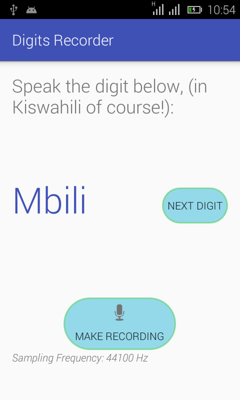

# Digits Recorder

Digits Recorder is a simple Android application that I developed to help me make short WAV audio recordings of spoken Swahili digits.

This is part of my bigger speech recognition application that I am developing as my final year project. It is based on the wonderful work done by the folks behind [Hertz](http://www.cl.cam.ac.uk/research/dtg/android/hertz/).

## What it does



The application displays the number that the user is supposed to speak. Upon tapping ```Make Recoding```, and speaking the digit, a WAV recording is made and saved on a folder called ```RawRecordings``` at the root of the internal storage of the phone.

**NOTE THAT**
The recordings are sampled at 44100Hz and encoded in 16-bit PCM.